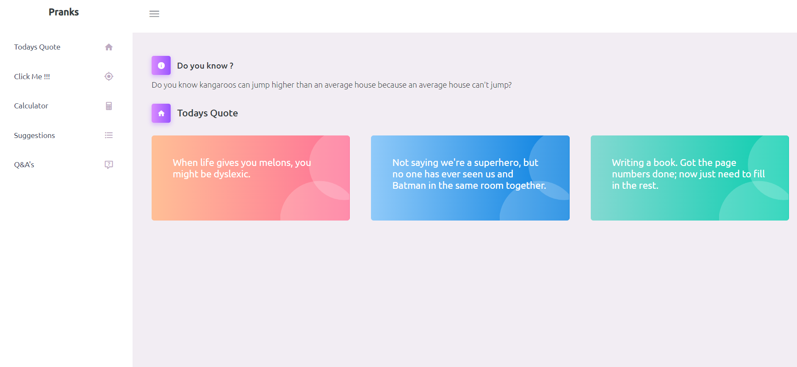
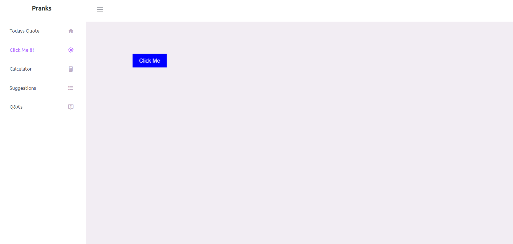
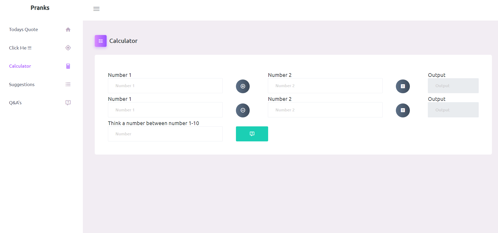
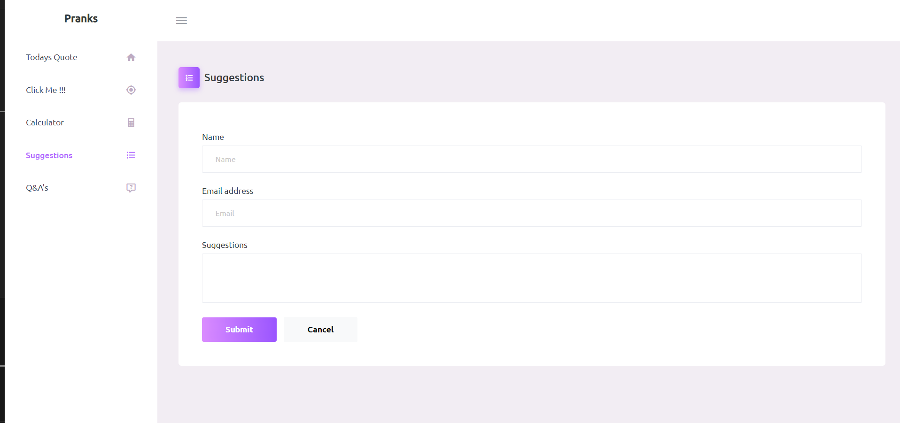
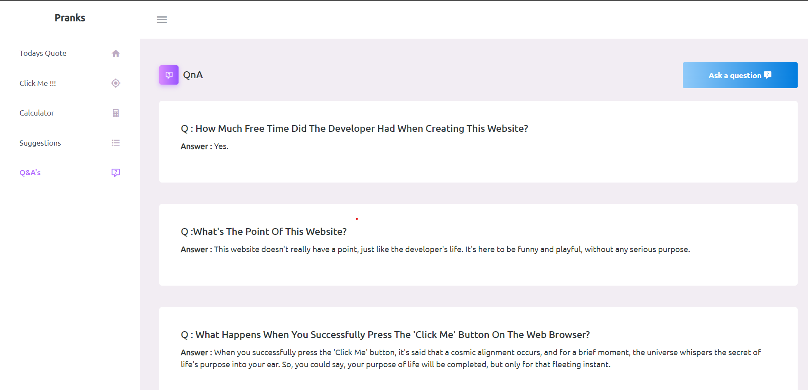

# Project Name
Pranks [Live Website](https://prank-bmo9.onrender.com/)

Open the project and find it yourself

## Table of Contents
- [Getting Started](#getting-started)
- [Usage](#usage)
- [JavaScript Packages](#javascript-packages)
- [Python Packages](#python-packages)

## Getting Started

This website does not serve any real life purpose it is just a waste of time for people who opens it ,specially for the person who created it by the wawy if you dont know the person its me

## Usage

1. **Funny quotes and Do you know**
    

    - This webpage offers nothing but some useless information.

2. **Click Me**
    
    -Click me is a button that runs away from your mouse ,but if you clicked it good for you.

3. **Calculator**

    
    -This calculates data on another level

3. **Suggestion**

    
    -You can give us some Suggestions if you can.

3. **QnA**

    
    -You can view some hard coded qna also you can ask me a question if you can

## JavaScript Packages

These are the packages used for frontend 

1. **Jquery**
    jQuery is a lightweight JavaScript library that simplifies DOM manipulation, event handling, and Ajax requests, making it ideal for enhancing web interactivity.

2. **Axios**
    Axios is a promise-based HTTP client for making HTTP requests in JavaScript, known for its simplicity and cross-browser compatibility, making it a great choice for handling API calls.

## Python Packages

This section lists the Python packages/modules used in your project. Provide a brief description of each and include links to their documentation or PyPI (Python Package Index) pages.

1. **Flask**
   -  Flask is a lightweight Python web framework that simplifies the process of building web applications. It provides tools for routing, handling HTTP requests, and creating web templates
   - [Installation] (pip install Flask)
